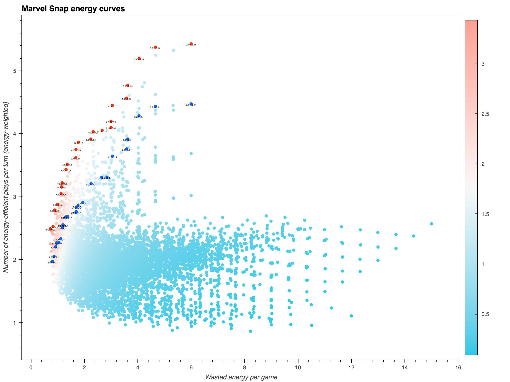

# Marvel Snap optimal energy curve

## Purpose

This repo's notebook simulates all 6188 possible energy curves in Marvel Snap and measures their performance along two dimensions:

1. The expected wasted energy per game.
2. The expected number of energy-efficient plays per turn (energy-weighted). These are the number of different plays you can expect to make each turn without wasting any energy. The expectation is energy-weighted, since the value of your available plays in a turn is (at least) proportional to the amount of energy you spend that turn.

## Results

The graph below visualizes all possible energy curves. The Pareto front is highlighted in red (🟥), and a constrained Pareto front with at least one 6-cost card in highlighted in blue (🟦).

The energy curve `2,4,3,2,1,0` wins both as having the highest energy efficiency among all energy curves, as well as having the highest ratio of number of plays over wasted energy.

